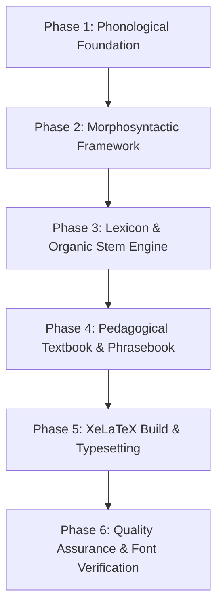

# Master Framework & Architecture for Algorithmic Language & Alphabet Generation

**A Generalized Specification & Technical Blueprint for Conlang Synthesis, Lexicon Engineering, and XeLaTeX Publication Automation**

---

## 1. Introduction & Executive Overview

This specification provides a generalized, domain-agnostic blueprint for designing, algorithmically generating, and publishing fully realized constructed languages (conlangs). Based on empirical engineering solutions, this framework covers the complete lifecycle:
- **Phonological & Acoustic Modeling**
- **Morphosyntactic Rules & Grammar**
- **Cross-Linguistic Organic Lexicon Generation**
- **Pedagogical Learning Suites & Interactive Exercises**
- **Multi-Volume XeLaTeX Publication Pipeline & Print Engineering**

---

## 2. Architecture & Pipeline Overview

---

## 3. Detailed Phase Specifications & Methodological Steps

### Phase 1: Phonological & Acoustic Foundation

1. **Phonetic Symbol Inventory:**
   - Establish atomic acoustic/symbolic building blocks grouped into functional categories (vowels/calls, continuous vibrants, explosives, fricatives, ingressive/egressive modifiers).
2. **Quantity Conservation & Syllable Weight:**
   - Enforce quantity conservation laws (e.g., *Long Call + Short Consonant* vs. *Short Call + Long Consonant*).
3. **Prosody & Tone Contours:**
   - Design pitch accent or tonal systems (e.g., Accent 1 High-Falling `/˥˩/` vs. Accent 2 Double-Wave `/˩˥˩/`).
4. **Multi-Dialect Accessibility:**
   - Define a primary/classical register alongside a simplified human-accessible register (substituting difficult phonetic sounds such as trilled R's with accessible schwa blends like `"ruh"` `/ɹə/`).

---

### Phase 2: Morphosyntactic & Structural Rules

1. **Clause Syntax (Verb-Second & Subclause Shift):**
   - Implement Verb-Second (V2) main clause syntax: $\text{Position 1 (Topic)} + \text{Position 2 (Verb)} + \text{Position 3 (Subject/Object)}$.
   - Define subclause word order shifts (S-A-V-O) where subordinating conjunctions suspend V2 and force sentence adverbs to precede finite verbs.
2. **Dynamic Gender & Article Systems:**
   - Categorize nouns into 2+ functional classes (e.g., Affective/Social vs. Inanimate/Territorial).
   - Use enclitic suffixes directly attached to root stems for definite articles instead of standalone pre-nominal words.
3. **Agglutinative Head-Modifier Compounding:**
   - Chain atomic stems where the final stem acts as the grammatical Head (determining class/gender) and preceding stems act as Modifiers, accompanied by stress/pitch shifts:
     $$\text{Stem}_{\text{modifier}} + \text{Stem}_{\text{head}} = \text{Compound Noun}$$
4. **Unambiguous Pronoun Paradigms:**
   - Eliminate homonyms between possessive singulars and subject plurals.
   - Enforce clean, matrix-based inflections: Subject = pure vowel (`-i`, `-u`, `-a`, `-o`, `-e`), Object = append `-m`, Possessive = append `-n`.

---

### Phase 3: Lexicon Generation & Multilingual Fit Engine

1. **Modern World Concept Alignment:**
   - Cover universal human modern life domains (technology, business, medicine, transit, daily life) rather than fantasy-only concepts.
2. **Organic Cross-Linguistic Sound Matching:**
   - Map target concepts across 10+ diverse natural language families (Semitic, Uralic, Bantu, Japonic, Turkic, Finno-Ugric, Austronesian, Indo-Iranian, Basque, etc.).
   - Calculate a **Phonetic Fit Score** measuring syllable balance and acoustic harmony into conlang glyphs.
3. **Multi-Tier Syllable Depth & Collision Prevention:**
   - High-frequency core concepts use 1–2 syllable stems.
   - Secondary and expansion concepts dynamically append multi-stem tiers (`s1`, `s2`, `s3`, `s4`) to guarantee 500,000+ unique headwords and **zero iteration collisions**.
4. **Performance & Memoization Caching:**
   - Memoize sound-matching (`_STEM_CACHE`) and IPA transcription (`_IPA_CACHE`) functions to prevent exponential $O(N^2)$ slowdowns, accelerating 10,000+ word generation from minutes to under 0.5 seconds.

---

### Phase 4: Pedagogical Textbook & Phrasebook Synthesis

1. **Structured Lesson Arc:**
   - Order chapters logically: Phonology $\rightarrow$ Nouns & Gender $\rightarrow$ V2 Syntax $\rightarrow$ Verb Tenses $\rightarrow$ Compounding $\rightarrow$ Plurals $\rightarrow$ Adjectives $\rightarrow$ Pronouns $\rightarrow$ Prepositions $\rightarrow$ Subclauses $\rightarrow$ Modals $\rightarrow$ Passives $\rightarrow$ Adverbs $\rightarrow$ Questions $\rightarrow$ Numerals $\rightarrow$ Participles $\rightarrow$ Pragmatics $\rightarrow$ Tech Syntax $\rightarrow$ Relative Clauses $\rightarrow$ Stylistics.
2. **Automated Glossary Injection:**
   - Dynamically inject lesson glossaries between `CHAPTER_GLOSSARY_START` and `CHAPTER_GLOSSARY_END` comments based on chapter metadata tags in the lexicon database.
3. **Dialogue Phrasebooks:**
   - Generate realistic daily dialogues (greetings, office meetings, cafes, transit, emergencies) featuring dual-dialect IPA transcriptions.

---

### Phase 5: XeLaTeX Multi-Volume Publication Engineering & Hurdles

1. **Table Width & Grid Overflows:**
   - **Problem:** Fixed horizontal padding and unconstrained `longtable` columns overflow printable margins.
   - **Solution:** Set document base font size to `8pt`, set `\setlength{\tabcolsep}{2.5pt}`, and define explicit proportioned wrapping paragraph columns (`p{1.5in}|p{2.4in}`) summing strictly to $\le$ printable page width (`6.2in`).
2. **Header Row Misalignment & Overfull Hboxes:**
   - **Problem:** Wrapping header cells in `\textbf{text}` creates rigid text groups that disable `\raggedright` paragraph wrapping, making header cells spill out horizontally and header rows wider than data rows.
   - **Solution:** Use `{\small\bfseries cell}` instead of `\textbf{cell}`. `\bfseries` sets bold font weight while **preserving** `\raggedright` column wrapping, ensuring header and data cells wrap at identical `p{width}` boundaries.
3. **Special Unicode Glyph Fallbacks & Missing Square Boxes (`[𓏌]`):**
   - **Problem:** Primary fonts (like `Segoe UI`) lack special glyphs (e.g., custom scripts, Egyptian Hieroglyphs U+13000, or IPA tone bars U+02E5–U+02E9), resulting in missing character fallback square boxes.
   - **Solution:**
     - Use `fontspec` in XeLaTeX to declare dedicated fallback font families (`\newfontfamily\hiero{Segoe UI Historic}`, `\newfontfamily\ipafont{Arial}`).
     - Automated regex replacement in markdown-to-latex parser to wrap glyph ranges in `{\hiero ...}` and `{\ipafont ...}`.
4. **Unicode Character Normalization:**
   - Normalize non-standard Unicode hyphens (`‐` U+2010), en-dashes (`–`), em-dashes (`—`), and ornate brackets (`﴾`, `﴿`) to standard ASCII equivalents before LaTeX processing.
5. **Escape Sequence Protection:**
   - Use raw string literals (`r"..."`) in Python generators to prevent carriage return conversion of LaTeX commands (e.g., turning `\rightarrow` into `ightarrow`).

---

## 4. Summary Checklist for Conlang Engine Implementation

- [ ] Define phonetic inventory, syllable conservation rules, and pitch accent contours.
- [ ] Implement V2 main clause syntax and subclause S-A-V-O word order rules.
- [ ] Establish an unambiguous matrix-based personal pronoun paradigm.
- [ ] Build a cross-linguistic phonetic fit matcher across 10+ diverse world languages.
- [ ] Memoize transcription and sound-matching functions for high-speed generation.
- [ ] Configure multi-tier headword depth (`s1`, `s2`, `s3`) to prevent expansion collisions.
- [ ] Automate textbook chapter generation with interactive exercise answer keys.
- [ ] Inject lesson glossaries dynamically into markdown textbook chapters.
- [ ] Configure XeLaTeX build pipeline with `8pt` font, `\tabcolsep=2.5pt`, and `p{width}` longtable column wrapping.
- [ ] Format table header cells using `{\small\bfseries cell}` to preserve `\raggedright` wrapping.
- [ ] Add `fontspec` fallback font families for custom scripts, hieroglyphs, and IPA tone bars.
- [ ] Validate XeLaTeX logs to confirm 0 `Missing character:` warnings.
