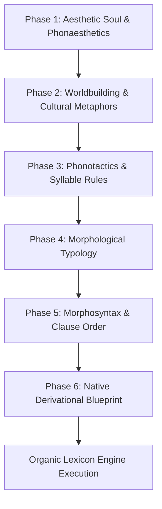

# Conlang Idea & Aesthetic Elicitation Protocol

**A Collaborative Framework for Defining the Soul, Phonotactics, Worldbuilding, and Grammar of a New Artificial Language**

---

## Executive Purpose

When creating a new constructed language (conlang), we must never simply translate English words piece-by-piece or invent arbitrary, disconnected sounds. Every authentic language is an organic expression of its speakers' **environment, biology, mindset, and cultural philosophy**.

This document provides an interactive elicitation interview protocol used to define the complete structural foundation of any new conlang before lexicon synthesis begins.

---

## The 6-Phase Conlang Elicitation Interview

When you tell the system:
> *"Create a set of language books for a new artificial language of this style: [Style Details]"*

The system steps through these six foundational design pillars:

---

### Phase 1: Aesthetic Soul & Phonaesthetics
Define the emotional, acoustic, and auditory impression of the language.

1.  **Acoustic Mood**:
    *   *Fluid & Vocalic*: Long open vowels, liquid consonants (`/l/`, `/r/`), soft glides (`/w/`, `/j/`) (e.g. Quenya, Polynesian).
    *   *Guttural & Consonantal*: Uvular stops (`/q/`), pharyngeal fricatives (`/ħ/`), harsh glottal stops (e.g. Klingon, Black Speech).
    *   *Staccato & Percussive*: Ejective consonants, palate clicks (`/!/`, `/ǂ/`), clipped coda stops.
    *   *Sibilant & Whispered*: High-frequency fricatives (`/s/`, `/ʃ/`, `/ɕ/`), voiceless nasals.
    *   *Resonant & Tonal*: Pitch-accent contours (High-falling, Rising-falling), nasal hums (`/m/`, `/ɲ/`, `/ŋ/`).
2.  **Biological Mechanics**:
    *   Are the speakers humanoid, feline, avian, reptilian, insectoid, or synthetic?
    *   What vocal tract or respiratory constraints exist (e.g., ingressive breaths, dual vocal cords, beak clicks)?

---

### Phase 2: Worldbuilding & Cultural Metaphors
Vocabulary is shaped by what a culture values, fears, and perceives in daily survival.

1.  **Ecological Environment**:
    *   *Desert Culture*: 20+ root words for moisture, shadow, sand textures, and oasis wells.
    *   *Maritime Culture*: Orientation described relative to wind currents and sea swells rather than static north/south.
    *   *Subterranean Culture*: Spatial axes based on depth, rock density, and airflow direction.
    *   *High-Tech / Orbital Culture*: Core roots based on energy, vectors, radiation, and vacuum.
2.  **Societal Values & Metaphors**:
    *   *What constitutes "Good"?* (e.g., Is "good" associated with *warmth*, *balance*, *sharpness*, or *light*?)
    *   *How is the self defined?* (e.g., Individual agency vs. collective clan-mesh vs. symbiotic familiar bonds).
    *   *How is time perceived?* (e.g., Future is *behind us* because it cannot be seen; past is *before our eyes* because it is remembered).

---

### Phase 3: Phonotactics & Syllable Rules
Establish the mathematical and phonetic boundaries of what sound combinations are legal.

1.  **Phonemic Inventory**:
    *   Consonants: List of active phonemes (e.g., stops, fricatives, nasals, liquids, glides).
    *   Vowels: 3-vowel (`/i, a, u/`), 5-vowel (`/i, e, a, o, u/`), or rich diphthong systems.
2.  **Syllable Shape Template**:
    *   Strict CV (e.g., Japanese, Hawaiian): `ka-la-ma-te`.
    *   Moderate CVC (e.g., Latin, Old English): `stan`, `helm`, `ber-an`.
    *   Complex (C)(C)V(C)(C) (e.g., Georgian, English): `str-eng-th`.
3.  **Forbidden Clusters & Sonority Hierarchy**:
    *   Explicitly ban awkward consonant transitions (e.g. `*pb`, `*kg`, `*tl`).
    *   Enforce sonority rises in onsets and falls in codas (Stops $\rightarrow$ Fricatives $\rightarrow$ Nasals $\rightarrow$ Liquids $\rightarrow$ Vowels).

---

### Phase 4: Morphological Typology
Determine how words are built and inflected.

1.  **Typological Class**:
    *   **Isolating / Analytic**: Words are fixed root stems; grammar is expressed purely through word order and separate helper particles (e.g. Mandarin, Vietnamese).
    *   **Agglutinative**: Morphemes attach like clean, distinct beads on a string, each carrying a single grammatical meaning (e.g. Turkish, Finnish, Hungarian).
    *   **Fusional**: Word endings merge multiple grammatical meanings (case + number + gender) into single inflections (e.g. Latin, Russian, Old English).
    *   **Polysynthetic**: Entire sentences can be compressed into a single complex verb head incorporating noun stems and adverbial affixes (e.g. Inuktitut, Navajo).

---

### Phase 5: Morphosyntax & Clause Order
Establish the fundamental syntactic architecture.

1.  **Clause Word Order**:
    *   `S-V-O` (Subject-Verb-Object)
    *   `S-O-V` (Subject-Object-Verb)
    *   `V-S-O` (Verb-Subject-Object)
    *   `V2` (Verb-Second: Main clause verb occupies position 2; subclause shift).
2.  **Morphosyntactic Alignment**:
    *   *Nominative-Accusative*: Subject of transitive and intransitive verbs treated identically; Object marked specially.
    *   *Ergative-Absolutive*: Subject of transitive verb marked specially (Ergative); Object of transitive and Subject of intransitive treated identically (Absolutive).
    *   *Active-Stative*: Marking depends on whether the subject has voluntary control over the action.
3.  **Head Directionality**:
    *   *Head-Initial*: Noun precedes adjective (`house white`), verb precedes object.
    *   *Head-Final*: Adjective precedes noun (`white house`), object precedes verb.

---

### Phase 6: Native Derivational Blueprint (Anti-Anglicism)
Specify how complex and modern words are generated from atomic roots.

1.  **Atomic Roots (200–300 primes)**: Generate roots for nature, body, motion, perception, and cognition.
2.  **Productive Native Affixes**:
    *   `Agentive`: One who does X (e.g., *heal* + `-ak` = *healer/doctor*).
    *   `Instrumental`: Tool for X (e.g., *reckon* + `-in` = *calculator/computer*).
    *   `Locative`: Place of X (e.g., *heal* + `-or` = *hospital/infirmary*).
    *   `Abstract`: Quality of X (e.g., *true* + `-ia` = *truth/justice*).
3.  **Semantic Compounding**:
    *   Combine native roots into culturally resonant compounds rather than borrowing English words:
        *   *Airplane* $\rightarrow$ `sky [tar]` + `vessel [vel]` = `tarvel`.
        *   *Curfew* $\rightarrow$ `night [kal]` + `bell [son]` + `law [lex]` = `kalsonlex`.
        *   *Internet* $\rightarrow$ `world [or]` + `web/bond [lig]` = `orlig`.

---

## Summary Checklist Before Running Generator

- [ ] Phonaesthetic mood and phoneme inventory approved.
- [ ] Syllable templates and forbidden clusters defined.
- [ ] Cultural worldview metaphors established.
- [ ] Morphological typology (Agglutinative / Fusional / Isolating) selected.
- [ ] Word order and alignment chosen.
- [ ] Derivational affix templates configured in `scripts/organic_lexicon_engine.py`.
- [ ] Anti-Anglicism validation pass completed.
