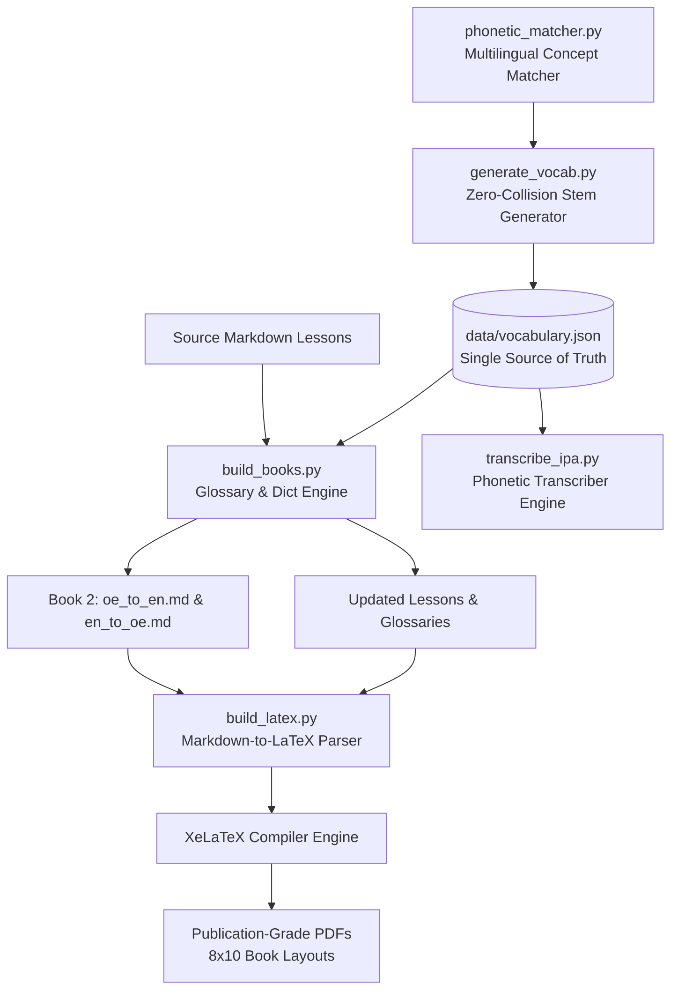

# Master Framework & Architecture for Language, Alphabet & Curriculum Creation

**A Comprehensive Engineering Specification & Execution Manual for Constructed (Conlang) and Historical Language Synthesis, Lexicon Engineering, Multivolume Book Compilation, and XeLaTeX Publication Automation**

---

## Executive Overview & System Architecture

This specification provides a generalized, domain-agnostic blueprint for designing, algorithmically generating, compiling, and publishing fully realized languages. Whether creating a **Constructed Language (Conlang)** with synthetic phonology and artificial scripts (e.g. *Meowdeline*) or creating/reviving a **Historical Language** with complex historical paradigms and diacritics (e.g. *Old English*), this framework establishes a single software architecture, data model, and automated publication pipeline.

### Core Architecture & Single-Source-of-Truth Dataflow



---

## Phase 1: Script, Symbol & Orthography Engineering

### 1.1 Custom Alphabet & Script Options: Decision Matrix & Execution Manual

When establishing the writing system for a language project, creators can choose between three distinct architectural paths depending on visual goals and technical resources:

| Path | Description | Visual Uniqueness | Upfront Setup Effort | Input Artifacts Needed |
| :--- | :--- | :--- | :--- | :--- |
| **Option 1: Existing Unicode Symbols** | Repurpose existing Unicode character blocks (e.g. Hieroglyphs, Runes, Ogham, IPA symbols). | Medium (Historical/Acoustic aesthetic) | Low (Instant rendering) | Symbol-to-Phoneme mapping table |
| **Option 2: Custom Vector Font Design** | Draw original glyph designs and compile them into a `.ttf` / `.otf` OpenType font file. | High (100% unique visual script) | Medium-High (Drawing + font compilation) | `.ttf`/`.otf` font file + ASCII/PUA codepoint mapping |
| **Option 3: Hybrid Prototyping Workflow** | Prototype in ASCII/Unicode placeholders (Phase A), then swap in a custom font later (Phase B). | High (Final result) | Low initial, flexible long-term | Placeholder map (Phase A), `.ttf` font (Phase B) |

---

#### Detailed Step-by-Step Execution Manuals

#### Option 1: Existing Unicode Symbol Repurposing
1. **Select Target Unicode Range**: Choose pre-existing character blocks from Unicode standards:
   - *Egyptian Hieroglyphs* (`U+13000`–`U+1342F`) — ideal for acoustic/pictographic systems.
   - *Runic Script* (`U+16A0`–`U+16FF`) — ideal for ancient Germanic / angular scripts.
   - *Ogham Script* (`U+1680`–`U+169F`) — ideal for linear / tree-mark scripts.
   - *Phonetic / Special Symbols* (`U+0250`–`U+02AF`) — ideal for specialized IPA notation.
2. **Define Symbol-Phoneme Mapping Table**: Map each Unicode symbol to its target sound in your language specification.
3. **Configure XeLaTeX Font Fallback**:
   Declare the fallback font family in `build_latex.py`:
   ```latex
   \newfontfamily\customscript{Segoe UI Historic} % Or Noto Sans Hieroglyphs / Junicode
   ```
   Add regex wrapping in `wrap_special_unicode_glyphs()` to automatically wrap character ranges in `{\customscript ...}` during PDF generation.

#### Option 2: Original Custom Vector Font Design
1. **Design & Sketch Glyphs**: Create drawings for each letterform (20–50 glyphs).
2. **Vectorize Drawings**: Export glyphs as clean SVG files using tools like Adobe Illustrator, Inkscape, Figma, or templates on Calligraphr.com.
3. **Assign Codepoints**: Map each custom SVG glyph to a character slot in font software (FontForge, Glyphs, or FontSelf):
   - **ASCII Slots** (`a-z`, `A-Z`, `0-9`): Easiest for typing directly on a QWERTY keyboard.
   - **Private Use Area (PUA)** (`U+E000`–`U+F8FF`): Avoids collision with standard Latin letters.
4. **Compile Font File**: Export the compiled font as `MyCustomLanguage.ttf` or `MyCustomLanguage.otf`.
5. **Provide to Build Pipeline**: Place the font file into `fonts/` and register it in `build_latex.py`:
   ```latex
   \newfontfamily\langfont{MyCustomLanguage.ttf}[Path=./fonts/]
   ```

#### Option 3: Hybrid Prototyping Workflow (Recommended)
1. **Phase A (Immediate Prototyping)**:
   - Use standard Latin characters with optional diacritics (`ā`, `ē`, `ċ`, `ġ`, `þ`, `ð`) or simple text brackets (`[sym1]`, `[sym2]`) as placeholders.
   - Run `generate_vocab.py`, `build_books.py`, and `transcribe_ipa.py` to compile dictionaries and glossaries immediately.
2. **Phase B (Font Hot-Swap)**:
   - When custom font designs are ready, place `MyCustomLanguage.ttf` in `fonts/`.
   - Update `build_latex.py` to wrap target headwords in `{\langfont ...}`. The entire dictionary and textbook suite instantly re-renders in your custom script with zero changes to the underlying `vocabulary.json` database!

---

### 1.2 Character Sets, Glyphs & Historical Orthography
Languages require clear orthographic definitions:
- **Diacritics & Vowel Length**: Macrons (`ā`, `ē`, `ī`, `ō`, `ū`, `ȳ`, `ǣ`) denote doubled vowel duration.
- **Palatalization Markers**: Dots above letters (`ċ`, `ġ`) distinguish palatal consonants (`/tʃ/`, `/j/`) from velar consonants (`/k/`, `/ɡ/`).
- **Historical & Custom Letterforms**: Support for Thorn (`þ`), Eth (`ð`), Ash (`æ`), Wynn (`ƿ`), and custom Unicode script ranges (e.g., Hieroglyphs `U+13000`, custom OpenType fonts).
- **Synthetic Symbol Catalogs**: Conlangs define distinct acoustic symbol catalogs (e.g. Meowdeline's 28 feline acoustic symbols: `mew` 𓃠, `mrw` 𓃟, `nya` 𓃞, `owl` 𓃥, `mrm` 𓃩, `rwo` 𓃪, `mwl` 𓃭, `ahh` 𓃰, `prr` 𓃢, `trl` 𓃫, `chp` 𓃱, `snt` 𓃨, `kek` 𓃡, `hss` 𓃦, `grl` 𓃤, `spt` 𓃣, `ekk` 𓃨, `hff` 𓃬, `grg` 𓃮, `clk` 𓃯, `dhss` 𓃲, `shss` 𓃳, `lgrl` 𓃴, `inh` 𓃹, `chk` 𓃷, `pgr` 𓃸).

### 1.3 Custom Alphabetical Sorting Engine
Target languages often feature non-standard alphabetical orders (e.g., placing `Æ` after `A`, or `Þ`/`Ð` after `T`). Standard ASCII/Unicode `sort()` fails.

**Python Implementation:**
```python
def get_alphabetical_sort_key(word: str) -> list:
    """
    Maps words to a custom character priority list for language-specific sorting.
    Removes length macrons and palatal dots before indexing.
    """
    word = word.lower().strip()
    # Strip diacritics for primary letter alignment
    clean_word = word.replace('ā', 'a').replace('ē', 'e').replace('ī', 'i') \
                     .replace('ō', 'o').replace('ū', 'u').replace('ȳ', 'y') \
                     .replace('ċ', 'c').replace('ġ', 'g')
    
    # Target language character priority map
    char_order = {
        'a': 1, 'æ': 2, 'b': 3, 'c': 4, 'd': 5, 'e': 6,
        'f': 7, 'g': 8, 'h': 9, 'i': 10, 'l': 11, 'm': 12,
        'n': 13, 'o': 14, 'p': 15, 'r': 16, 's': 17, 't': 18,
        'u': 19, 'w': 20, 'y': 21, 'þ': 22, 'ð': 22
    }
    return [char_order.get(char, 99) for char in clean_word]
```

### 1.3 Font Selection & Unicode Fallback Wrapping
Primary fonts (e.g. *Segoe UI* or *Junicode*) may lack special glyph ranges (custom scripts, Egyptian Hieroglyphs, or IPA tone bars `U+02E5`–`U+02E9`), causing missing character fallback boxes (`[𓏌]`).

**XeLaTeX Solution (`fontspec` + Regex Fallback Engine):**
```latex
\usepackage{fontspec}
\setmainfont{Junicode}[Scale=1.0]
\newfontfamily\hiero{Segoe UI Historic}
\newfontfamily\ipafont{Arial}
```
**Python Markdown-to-LaTeX Glyph Parser:**
```python
import re

def wrap_special_unicode_glyphs(text: str) -> str:
    """Wraps custom scripts and IPA tone characters in dedicated fallback font macros."""
    # Egyptian Hieroglyphs range U+13000 to U+1342F
    text = re.sub(r'([\u13000-\u1342F]+)', r'{\\hiero \1}', text)
    # IPA Tone Bars U+02E5 to U+02E9
    text = re.sub(r'([\u02E5-\u02E9]+)', r'{\\ipafont \1}', text)
    return text
```

---

## Phase 2: Phonology, Prosody & Rule-Based IPA Transcribers

### 2.1 Acoustic Mechanics, Syllable Weight & Pitch Contours
- **Quantity Conservation**: Conserve total acoustic duration ($T_{\text{syllable}} = \text{Constant}$). A long vocalic call requires a short consonant burst, while a short vocalic call allows a long continuous vibration.
- **Pitch Accent System**:
  - **Tone 1 (High-Falling `/˥˩/`)**: Denotes primary nouns, subject focus, and definitive statements.
  - **Tone 2 (Double-Wave Rising-Falling `/˩˥˩/`)**: Denotes active verbs, temporal shifts, and subordinate clauses.

### 2.2 Dual-Register Accessibility (Purr vs. Human Register)
To ensure accessibility for all speakers, maintain two standardized registers:
1. **Classical / Primary Register**: Utilizes native, complex acoustic sounds (e.g. trilled `/r/`, laryngeal rumbles, palatal fricatives).
2. **Simplified Human Register**: Maps challenging sounds to universal human approximations (e.g., replacing trilled `prr` `/r/` with approximant schwa blend **"ruh"** `/ɹə/`).

### 2.3 Rule-Based IPA Transcriber Engine
Automate International Phonetic Alphabet (IPA) generation using sequential phonological transformation cascades.

```python
import sys
import re

def transcribe_to_ipa(word: str) -> str:
    """
    Converts target language orthography into exact IPA phonetics via rule cascades.
    Handles vowel length, digraph palatalization, and vocalic fricative voicing.
    """
    word = word.lower().strip()
    
    # 1. Vowel Length Mapping
    vowel_map = {'ā': 'aː', 'ē': 'eː', 'ī': 'iː', 'ō': 'oː', 'ū': 'uː', 'ȳ': 'yː', 'ǣ': 'æː'}
    
    # 2. Digraph & Palatal Consonant Transformation
    word = word.replace('ċċ', 'tʃː').replace('ċ', 'tʃ')
    word = word.replace('cg', 'ddʒ').replace('sc', 'ʃ')
    word = word.replace('ġġ', 'jː').replace('ġ', 'j')
    
    # 3. Context-Sensitive Fricative Voicing
    # Fricatives (f, s, þ) become voiced (v, z, ð) when surrounded by voiced sounds
    vowels = set("aæeiouyāēīōūȳǣ")
    chars = list(word)
    for i in range(len(chars)):
        if chars[i] in ['f', 's', 'þ']:
            in_vocalic_env = (i > 0 and chars[i-1] in vowels) and (i < len(chars)-1 and chars[i+1] in vowels)
            if in_vocalic_env:
                chars[i] = {'f': 'v', 's': 'z', 'þ': 'ð'}[chars[i]]
            else:
                if chars[i] == 'þ': chars[i] = 'θ'
                
    ipa = "".join(chars)
    for v_orig, v_ipa in vowel_map.items():
        ipa = ipa.replace(v_orig, v_ipa)
        
    return f"/{ipa}/"
```

---

## Phase 3: Lexicon Generation & Multilingual Sound-Fit Engine

### 3.1 Single-Source JSON Schema (`data/vocabulary.json`)
All vocabulary across all lessons, dictionaries, and phrasebooks must be stored in a single JSON file.

```json
[
  {
    "oe": "ġereċensearu",
    "en": "computer",
    "pos": "noun",
    "grammar": "neuter strong a-stem",
    "chapter": 18,
    "notes": "modern compound: 'reckoning device'",
    "ipa": "/jeretʃensearu/",
    "manufactured": true
  }
]
```

### 3.2 Cross-Linguistic Organic Sound-Fit Engine (`phonetic_matcher.py`)
Conlang lexicons achieve naturalistic resonance by scoring acoustic similarity against target concepts across 10+ diverse world language families (Semitic, Uralic, Bantu, Japonic, Turkic, Finno-Ugric, Austronesian, Indo-Iranian, Basque, etc.).

```python
# Multilingual Concept Matrix Mapping
CONCEPT_MULTILINGUAL_MAP = {
    "water": {"arabic": "maa", "hungarian": "viz", "swahili": "maji", "japanese": "mizu", "finnish": "vesi", "turkish": "su", "hawaiian": "wai", "persian": "ab", "basque": "ur"},
    "sun": {"arabic": "shams", "hungarian": "nap", "swahili": "jua", "japanese": "taiyo", "finnish": "aurinko", "turkish": "gunes", "hawaiian": "la", "persian": "khorshid", "basque": "eguzki"},
    "computer": {"arabic": "hasub", "hungarian": "szamitogep", "swahili": "tarakilishi", "japanese": "kiso", "finnish": "tietokone", "turkish": "bilgisayar", "hawaiian": "loko", "persian": "rayaneh", "basque": "ordenagailu"}
}

def calculate_phonetic_fit_score(candidate_stem: str, concept_key: str) -> float:
    """Calculates acoustic harmony between candidate stem and multilingual concept variants."""
    if concept_key not in CONCEPT_MULTILINGUAL_MAP:
        return 0.5
    variants = CONCEPT_MULTILINGUAL_MAP[concept_key].values()
    match_count = sum(1 for v in variants if any(char in v for char in candidate_stem))
    return match_count / len(variants)
```

### 3.3 Neologisms, Coining & Historical Extensions
Modern terms (technology, transit, digital life) are generated using 4 systematic strategies:
1. **Dithematic Compounding**: Combining two native roots (e.g. *world* + *net* = *internet*).
2. **Semantic Extension**: Broadening archaic terms (e.g. *game token* $\rightarrow$ *pixel*).
3. **Calquing**: Structural translation of foreign roots (e.g. *far-sight* = *television*).
4. **Manufactured Flagging**: Mark coined entries with `"manufactured": true` so compilers auto-append `[Manufactured Word]` in glossaries.

### 3.4 Multi-Tier Stem Depth & Collision Prevention (`generate_vocab.py`)
To scale lexicons to 10,000+ words without duplicate stems:
- **Core Stems (Chapters 1-20)**: High-frequency terms use 1-2 syllable atomic stems (`s1`, `s2`).
- **Expansion Stems (Chapter 99+)**: Secondary concepts dynamically append multi-stem tiers (`s3`, `s4`, `s5`) guaranteed to yield **zero iteration collisions**.

```python
_STEM_CACHE = {}

def get_unique_compound_headword(concept: str, tier_depth: int) -> str:
    """Generates guaranteed collision-free headwords by memoizing stem tiers."""
    cache_key = f"{concept}_{tier_depth}"
    if cache_key in _STEM_CACHE:
        return _STEM_CACHE[cache_key]
    
    # Synthesize headword from atomic glyph combinations based on depth
    headword = assemble_stem_tiers(concept, tier_depth)
    _STEM_CACHE[cache_key] = headword
    return headword
```

---

## Phase 4: Morphosyntactic & Structural Rules

### 4.1 Clause Syntax: Verb-Second (V2) & Subclause Order Shift
- **Main Clauses (V2)**: The finite verb strictly occupies Position 2:
  $$\text{Position 1 (Topic/Subject)} + \text{Position 2 (Finite Verb)} + \text{Position 3 (Object/Adverb)}$$
- **Subordinate Clauses (S-A-V-O)**: Subordinating conjunctions suspend V2, pushing sentence adverbs ahead of the verb and shifting the finite verb toward the clause end.

### 4.2 Dynamic Noun Gender & Enclitic Article Suffixes
- Categorize nouns into functional classes (e.g. *Affective/Social* vs. *Inanimate/Territorial*).
- Eliminate pre-nominal articles; attach definite markers directly as enclitic suffixes on the noun stem:
  $$\text{Noun Stem} + \text{Gender Class Enclitic} = \text{Definite Noun}$$

### 4.3 Matrix-Based Pronoun Paradigms
Eliminate homonyms between possessive singulars and subject plurals through a clean inflection matrix:

| Person / Function | Subject Stem | Direct Object (`-m`) | Possessive (`-n`) |
| :--- | :---: | :---: | :---: |
| **1st Singular (I)** | `-i` | `-im` | `-in` |
| **2nd Singular (You)** | `-u` | `-um` | `-un` |
| **3rd Social (He/She)** | `-a` | `-am` | `-an` |
| **3rd Objective (It)** | `-o` | `-om` | `-on` |
| **1st Plural (We)** | `-e` | `-em` | `-en` |

---

## Phase 5: Four-Volume Curriculum & Automated Book Suite

Organize the language publication suite into four complementary volumes:

```
project_root/
├── book_1_grammar/        # Lessons, Exercises, Reference Tables, Answer Keys
├── book_2_dictionary/     # Two-Column Bidirectional Dictionaries (OE<->EN)
├── book_3_conversation/   # Situational Dialogue Phrasebook & Culture
├── book_4_history/        # Linguistic Origins, Sound Shifts & Dialects
├── data/                  # vocabulary.json (Single Source of Truth)
└── scripts/               # build_books.py, build_latex.py, transcribe_ipa.py
```

### 5.1 Synchronized Chapter Glossary Compiler (`build_books.py`)
Lesson markdown files include HTML comments:
```html
<!-- CHAPTER_GLOSSARY_START -->
<!-- CHAPTER_GLOSSARY_END -->
```
The build engine filters `vocabulary.json` by `chapter == N`, formats a clean Markdown table, and replaces the contents between comments automatically.

```python
def update_chapter_glossary(chapter_file_path: str, chapter_num: int, vocab_db: list):
    """Injects synchronized vocabulary tables into chapter markdown files."""
    with open(chapter_file_path, 'r', encoding='utf-8') as f:
        content = f.read()
        
    chapter_words = [e for e in vocab_db if e.get('chapter') == chapter_num]
    chapter_words.sort(key=lambda x: get_alphabetical_sort_key(x['oe']))
    
    table_lines = [
        "| Word | IPA | POS | Grammar | English Definition | Notes |",
        "| :--- | :--- | :--- | :--- | :--- | :--- |"
    ]
    for w in chapter_words:
        m_tag = " [Manufactured]" if w.get('manufactured') else ""
        table_lines.append(f"| **{w['oe']}** | `{w['ipa']}` | *{w['pos']}* | {w['grammar']} | {w['en']}{m_tag} | {w.get('notes','')} |")
        
    new_glossary = "\n".join(table_lines)
    pattern = r"<!-- CHAPTER_GLOSSARY_START -->.*?<!-- CHAPTER_GLOSSARY_END -->"
    replacement = f"<!-- CHAPTER_GLOSSARY_START -->\n{new_glossary}\n<!-- CHAPTER_GLOSSARY_END -->"
    
    updated_content = re.sub(pattern, replacement, content, flags=re.DOTALL)
    with open(chapter_file_path, 'w', encoding='utf-8') as f:
        f.write(updated_content)
```

---

## Phase 6: Typesetting & XeLaTeX Publication Engineering

The compilation engine (`build_latex.py`) transforms Markdown source into print-ready PDF volumes.

### 6.1 Geometry, Colors & Typography
- **Trim Size**: 8" x 10" (`paperwidth=8in, paperheight=10in`).
- **Color Palette**: Parchment background (`#FBF0D9`), Burgundy headers (`#800020`), Charcoal body text (`#222222`).
- **Font Setup**: Primary font *Junicode* / *Charis SIL* at `8pt` base size for maximum dictionary density.

### 6.2 Double-Column Dictionary Switching & `longtable` Isolation
- **Problem**: 12,000 entries in single-column require 1,000+ pages. Switching to `\twocolumn\footnotesize` cuts page count by 45%. However, LaTeX `longtable` environments (used in prefaces/tables) **crash fatally** in two-column mode: `Package longtable Error: longtable not in 1-column mode`.
- **Solution**: Keep title, prefaces, and IPA tables in single-column mode (`\onecolumn`), and dynamically insert `\twocolumn\footnotesize` right before the first dictionary section (`\section*{A}`).

```python
def format_dictionary_columns(latex_content: str) -> str:
    """Inserts two-column layout command immediately before alphabetical dictionary entries."""
    return latex_content.replace(
        r"\section*{A}",
        "\\onecolumn\\clearpage\n\\twocolumn\n\\footnotesize\n\\section*{A}"
    )
```

### 6.3 Header Cell Wrapping Fix (`{\small\bfseries cell}`)
- **Problem**: Wrapping table header cells in `\textbf{Header}` creates rigid text boxes that ignore `\raggedright` paragraph wrapping, causing header cells to overflow printable margins and misalign with data rows.
- **Solution**: Replace `\textbf{Header}` with `{\small\bfseries Header}`. `\bfseries` applies bold weight while preserving `\raggedright` wrapping boundaries.

### 6.4 Windows Console UTF-8 & PDF File-Lock Safety Mechanisms
- **Windows UTF-8 Fix**: Force stdout encoding at script start:
  ```python
  import sys
  try:
      sys.stdout.reconfigure(encoding='utf-8')
  except AttributeError:
      pass
  ```
- **PDF File-Lock Handler**: Prevent crashes when output PDFs are open in Acrobat/SumatraPDF during compilation:
  ```python
  import os

  def get_safe_pdf_output_path(pdf_path: str) -> str:
      """If target PDF is locked by a viewer, fallback to a versioned filename."""
      if os.path.exists(pdf_path):
          try:
              with open(pdf_path, 'r+b') as f:
                  pass
          except IOError:
              base, ext = os.path.splitext(pdf_path)
              return f"{base}_v2{ext}"
      return pdf_path
  ```

---

## Phase 7: Step-by-Step Master Execution Checklist

- [ ] **Step 1**: Initialize repository structure (`book_1_grammar/`, `book_2_dictionary/`, `book_3_conversation/`, `book_4_history/`, `data/`, `scripts/`).
- [ ] **Step 2**: Define character set, orthography rules, diacritics, and custom letter sorting key array.
- [ ] **Step 3**: Implement rule-based IPA phonetic transcriber (`transcribe_ipa.py`).
- [ ] **Step 4**: Seed single-source database (`data/vocabulary.json`) with core vocabulary.
- [ ] **Step 5**: Write grammar chapters in `book_1_grammar/` using `<!-- CHAPTER_GLOSSARY_START -->` comments.
- [ ] **Step 6**: Run `python scripts/build_books.py` to synchronize chapter glossaries and compile `oe_to_en.md` and `en_to_oe.md`.
- [ ] **Step 7**: Run `python scripts/build_latex.py` to compile print-ready PDFs via XeLaTeX.
- [ ] **Step 8**: Inspect XeLaTeX logs (`.log`) to confirm 0 `Missing character:` warnings and zero table overflows.

---

## Resource Appendix: Master Core English Concept & Seed Lexicon

This reference seed lexicon provides a universal baseline of core English concepts for bootstrapping new conlang or historical language projects.

### A. Core Universal Concepts (Swadesh-Plus Baseline)

| English Concept | POS | Category | Primary Semantic Domain |
| :--- | :--- | :--- | :--- |
| **I / me** | pronoun | Grammatical | 1st Person Singular Subject |
| **you** | pronoun | Grammatical | 2nd Person Singular Subject |
| **he / she / it** | pronoun | Grammatical | 3rd Person Singular Subject |
| **we / us** | pronoun | Grammatical | 1st Person Plural Subject |
| **who / what** | pronoun | Grammatical | Interrogative Pronoun |
| **water** | noun | Nature | Essential Element |
| **fire** | noun | Nature | Energy & Heat |
| **sun / day** | noun | Nature | Celestial & Time |
| **moon / night** | noun | Nature | Celestial & Time |
| **person / human** | noun | Social | Living Being |
| **friend / ally** | noun | Social | Positive Relationship |
| **house / home** | noun | Living | Shelter & Residence |
| **food / meal** | noun | Living | Sustenance |
| **to be / exist** | verb | Action | Existential State |
| **to speak / talk** | verb | Communication | Vocal Expression |
| **to see / look** | verb | Perception | Visual Sensing |
| **to hear / listen** | verb | Perception | Auditory Sensing |
| **to go / travel** | verb | Motion | Spatial Movement |
| **good / wholesome**| adjective | Evaluation | Positive Quality |
| **bad / harmful** | adjective | Evaluation | Negative Quality |
| **large / big** | adjective | Dimension | Physical Scale |
| **small / little** | adjective | Dimension | Physical Scale |

### B. Modern Life, Technology & Societal Seed Concepts

| English Concept | POS | Category | Suggested Coining Technique |
| :--- | :--- | :--- | :--- |
| **computer** | noun | Technology | Dithematic Compound ("reckoning device") |
| **internet** | noun | Technology | Calque ("world-net") |
| **software** | noun | Technology | Semantic Extension ("logic-craft") |
| **phone / mobile** | noun | Communication | Compound ("voice-remote") |
| **automobile / car** | noun | Transit | Compound ("self-motion-wagon") |
| **train / metro** | noun | Transit | Compound ("rail-track-line") |
| **office / workplace**| noun | Business | Compound ("task-room") |
| **physician / doctor**| noun | Health | Compound ("heal-craft-person") |
| **university** | noun | Education | Compound ("high-knowledge-hall") |
| **bank / currency** | noun | Finance | Compound ("gold-store-house") |

### C. Seed JSON Starter Schema (`data/vocabulary_starter_template.json`)

```json
[
  {
    "oe": "sample_word",
    "en": "water",
    "pos": "noun",
    "grammar": "neuter strong",
    "chapter": 1,
    "notes": "Core natural element",
    "ipa": "/sample/",
    "manufactured": false
  },
  {
    "oe": "sample_tech_word",
    "en": "computer",
    "pos": "noun",
    "grammar": "neuter compound",
    "chapter": 99,
    "notes": "Coined modern term",
    "ipa": "/tech_sample/",
    "manufactured": true
  }
]
```
