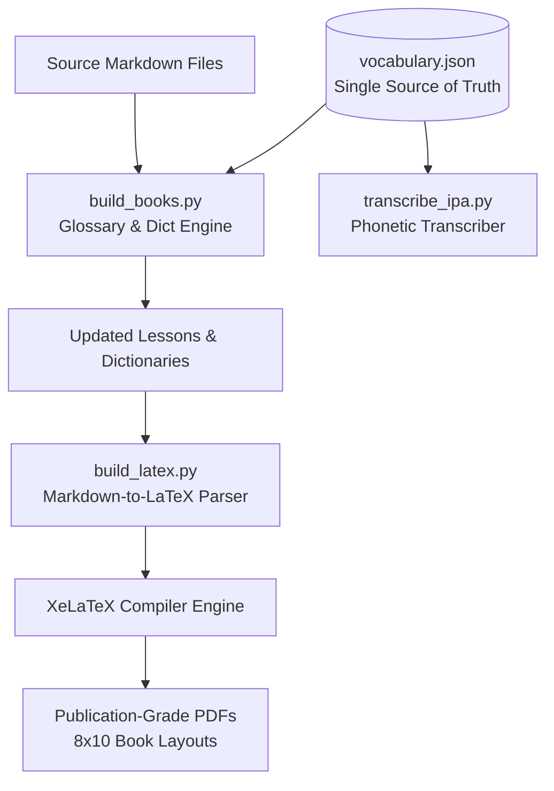

# Master Blueprint: Language & Alphabet Generation Framework
**A Complete Engineering Methodology for Constructing, Compiling, and Publishing Artificial and Historical Languages**

---

## Executive Overview

Building a fully realized language (whether a constructed conlang, a historical dialect, or a synthesized linguistic revival) requires more than just grammar rules—it requires a **scalable software architecture**, a **single-source-of-truth database**, a **phonetic engine**, and an **automated publication pipeline**.

This master document captures the complete methodology, architectural patterns, algorithmic solutions, and typesetting engineering hurdles solved during the creation of a multi-volume language curriculum and 12,000-word dictionary suite.

---

## System Architecture Overview



---

## Step 1: Orthography & Phonological Design

### 1.1 Character Set & Glyphs
*   **Special Characters**: Define diacritics (macrons for vowel length, dots for palatalization) and distinct letterforms (e.g., thorn, eth, ash, wynn).
*   **Font Selection**: Use a font with broad Unicode coverage for historical/constructed glyphs (e.g., *Junicode*, *Charis SIL*, or custom OpenType fonts).

### 1.2 Rule-Based Phonetic Transcriber (IPA)
When generating large lexicons (thousands of entries), manually transcribing International Phonetic Alphabet (IPA) values is error-prone. A **rule-based phonetic engine** converts orthography to IPA automatically using phonological transformation cascades:

```python
def transcribe_to_ipa(word):
    word = word.lower().strip()
    
    # Phase 1: Normalize Vowel Length & Accent Markers
    vowel_map = {'ā': 'aː', 'ē': 'eː', 'ī': 'iː', 'ō': 'oː', 'ū': 'uː'}
    
    # Phase 2: Digraph & Palatalization Replacement
    word = word.replace('ċċ', 'tʃː').replace('ċ', 'tʃ')
    word = word.replace('cg', 'ddʒ').replace('sc', 'ʃ')
    
    # Phase 3: Context-Sensitive Fricative Voicing
    # Fricatives are voiced when situated between vowels/voiced sounds
    vowels = set("aæeiouyāēīōū")
    chars = list(word)
    for i in range(len(chars)):
        if chars[i] in ['f', 's', 'þ']:
            in_vocalic_env = (i > 0 and chars[i-1] in vowels) and (i < len(chars)-1 and chars[i+1] in vowels)
            if in_vocalic_env:
                chars[i] = {'f': 'v', 's': 'z', 'þ': 'ð'}[chars[i]]
            else:
                if chars[i] == 'þ': chars[i] = 'θ'
                
    # Phase 4: Gemination & IPA Formatting
    ipa = "".join(chars)
    for v_orig, v_ipa in vowel_map.items():
        ipa = ipa.replace(v_orig, v_ipa)
        
    return f"/{ipa}/"
```

### 1.3 Windows Console Encoding Safeguard
*   **Hurdle**: Python scripts printing non-ASCII Unicode glyphs (macrons, IPA symbols, thorn) to standard output on Windows crash with `UnicodeEncodeError: 'charmap' codec can't encode...`.
*   **Solution**: Force stdout to reconfigure to UTF-8 at script initialization:
    ```python
    import sys
    try:
        sys.stdout.reconfigure(encoding='utf-8')
    except AttributeError:
        pass
    ```

---

## Step 2: Vocabulary Database Schema (`vocabulary.json`)

To ensure consistency across lessons, glossaries, and dictionaries, **all vocabulary must reside in a single JSON database**.

```json
[
  {
    "oe": "ġereċensearu",
    "en": "computer",
    "pos": "noun",
    "grammar": "neuter strong a-stem",
    "chapter": 18,
    "notes": "modern compound: 'reckoning device'",
    "ipa": "/jeretʃensearu/",
    "manufactured": true
  }
]
```

### Neologisms & Modern Vocabulary Adaptation
For constructed or revived languages, modern terms (technology, society, gaming) must be coined systematically:
1.  **Dithematic Compounding**: Joining two native roots (e.g., *world* + *net* = *internet*).
2.  **Semantic Extension**: Assigning modern meanings to ancient words (e.g., *game token* $\rightarrow$ *pixel*).
3.  **Calquing**: Translating foreign roots component-by-component (e.g., *far-sight* = *television*).
4.  **Neologism Flagging**: Mark modern coined terms with `"manufactured": true` so the compiler automatically tags them in text output (e.g., `[Manufactured Word]`).

---

## Step 3: Automated Glossary & Dictionary Compilation Engine

The compilation script (`build_books.py`) performs two automated tasks:

### 3.1 Synchronized Chapter Glossaries
Lesson files use HTML comment placeholders:
```html
<!-- CHAPTER_GLOSSARY_START -->
<!-- CHAPTER_GLOSSARY_END -->
```
The build script filters `vocabulary.json` by `chapter == N`, formats a table, and rewrites the chapter markdown file automatically.

### 3.2 Custom Alphabetical Sorting Engine
Target languages often have non-standard alphabetical orders (e.g., placing `Æ` after `A`, or `Þ` at the end of the alphabet). Standard `sort()` fails because it uses default ASCII/Unicode codepoints.

*   **Solution**: Implement a custom sort key function mapping custom letter ranks:
    ```python
    def get_alphabetical_sort_key(word):
        word = word.lower().strip()
        # Remove non-alphabetic length macrons and dots
        clean_word = word.replace('ā', 'a').replace('ċ', 'c').replace('ġ', 'g')
        
        # Map custom character priorities
        char_order = {
            'a': 1, 'æ': 2, 'b': 3, 'c': 4, 'd': 5, 'e': 6,
            'f': 7, 'g': 8, 'h': 9, 'i': 10, 'l': 11, 'm': 12,
            'n': 13, 'o': 14, 'p': 15, 'r': 16, 's': 17, 't': 18,
            'u': 19, 'w': 20, 'y': 21, 'þ': 22, 'ð': 22
        }
        return [char_order.get(char, 99) for char in clean_word]
    ```

---

## Step 4: Multivolume Book Architecture

Organize the language curriculum into distinct volumes:

1.  **Book 1: Grammar & Lessons**:
    *   Graduated chapters (phonology $\rightarrow$ basic declensions $\rightarrow$ verb tenses $\rightarrow$ complex syntax $\rightarrow$ modern concepts).
    *   Historical annotated readings.
    *   **Grammatical Reference Tables Appendix**: Consolidated paradigms for all noun classes, verb classes, and pronouns.
    *   **Answer Key Appendix**: Solutions for all chapter exercises.
2.  **Book 2: Dictionaries**:
    *   Bidirectional listing (Target $\rightarrow$ English, English $\rightarrow$ Target).
    *   IPA Pronunciation Guide and licensing/sources notices.
3.  **Book 3: Conversational Phrasebook**:
    *   Situational dialogues (trade, legal, truce, digital life, gaming, climate).
    *   Phonetic respelling guides and cultural sidebars.
4.  **Book 4: History & Dialects**:
    *   Linguistic origins, dialectal variations, sound shifts, and modern purism movements.

---

## Step 5: Typesetting & PDF Pipeline Engineering

The script `build_latex.py` converts Markdown to TeX and compiles PDF volumes using XeLaTeX.

### 5.1 Geometry & Typography
*   **Trim Size**: Standard personal format (8" x 10" / `paperwidth=8in, paperheight=10in`).
*   **Colors**: Parchment background (`#FBF0D9`), burgundy headers (`#800020`).

### 5.2 Layout Switching & Column Hurdles
*   **Hurdle**: A 12,000-word single-column dictionary produces 1,000+ pages. Switching to `\twocolumn` with a reduced font (`\footnotesize`, ~9pt) compresses the page count by 45%.
*   **Fatal Crash**: LaTeX `longtable` environments (used for Markdown tables in prefaces and IPA guides) **cannot run in two-column mode** and throw a fatal error: `Package longtable Error: longtable not in 1-column mode`.
*   **Solution**: Keep the title page, preface, and IPA guide tables in single-column mode (`\onecolumn`), and switch to double-column (`\twocolumn\footnotesize`) only when the first alphabetical letter section (`\section*{A}`) begins:
    ```python
    latex_body = latex_body.replace(
        r"\section*{A}",
        "\\twocolumn\n\\footnotesize\n\\section*{A}"
    )
    ```

### 5.3 File-Lock Safety Mechanism
*   **Hurdle**: Compiling LaTeX while an output PDF is open in a viewer (Acrobat, SumatraPDF) causes permission denied crashes.
*   **Solution**: Check write access before compiling; if locked, fallback to a versioned output name (`book2_dictionary_v2.pdf`):
    ```python
    def check_pdf_write_permission(pdf_path):
        if os.path.exists(pdf_path):
            try:
                with open(pdf_path, 'r+b') as f:
                    pass
            except IOError:
                base, ext = os.path.splitext(pdf_path)
                return base + "_v2" + ext
        return pdf_path
    ```

---

## Step 6: Step-by-Step Execution Checklist for New Languages

1.  **Setup Database**: Create `data/vocabulary.json` and add core vocabulary.
2.  **Build Transcriber**: Adapt `transcribe_to_ipa()` for the new language's phonology.
3.  **Draft Lessons**: Write chapters in `book_1_grammar/` using `<!-- CHAPTER_GLOSSARY_START -->`.
4.  **Run Glossary Compiler**: Execute `python scripts/build_books.py` to populate chapter glossaries and generate `oe_to_en.md` and `en_to_oe.md`.
5.  **Run PDF Compiler**: Execute `python scripts/build_latex.py` to produce print-ready PDFs.
