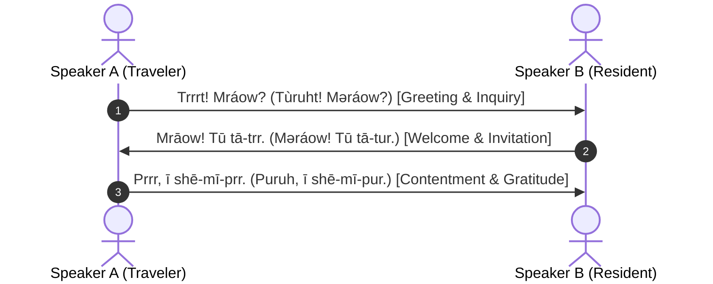

# Phrasebook 1: Greetings, Social Protocol & Scent Etiquette

**Practical Conversational Dialogues in Dual Dialects (Trill & Ruh)**

---

## Dialogue 1: Approaching a Threshold & Meeting a Companion

**Context**: Traveler A approaches a settlement boundary and calls out politely. Resident B responds warmly.

### 1. Speaker A (Approaching)
- **Mraow-Trill**: *Trrrt! Mráow? Ī fō-trr?*
- **Mraow-Ruh**: *Tùruht! Məráow? Ī fō-tur?*
- **IPA**: `/trːt¹⁵ mraʊ¹⁵ ʔiː foːtrː/` vs `/ˈtʊ.rʌt¹⁵ məˈraʊ¹⁵ ʔiː foːtʊr/`
- **Gloss**: `chirp.GREETING inquiry? 1SG approach-HORT`
- **Translation**: *"Greetings! Who is there? May I approach peacefully?"*

### 2. Speaker B (Welcoming)
- **Mraow-Trill**: *Mrāow! Nyā-kē shō nō, tū tā-trr.*
- **Mraow-Ruh**: *Məráow! Nyā-kē shō nō, tū tā-tur.*
- **IPA**: `/mraʊ⁵⁵ ɲaːkeː ʃoː noː tuː taːtrː/`
- **Gloss**: `hello! claws retract TOP, 2SG enter-HORT`
- **Translation**: *"Hello! With claws sheathed in peace, please enter."*

### 3. Speaker A (Expressing Harmony)
- **Mraow-Trill**: *Prrr, prōm nō ī shā-prr.*
- **Mraow-Ruh**: *Puruh, purōm nō ī shā-pur.*
- **IPA**: `/prː proːm noː ʔiː ʃaːprː/`
- **Gloss**: `yes.CONTENT den.BEN TOP 1SG see-BEN`
- **Translation**: *"Ah, wonderful! I am so glad to see this safe sanctuary."*

---

## Dialogue 2: Departing on a Long Journey

### 1. Traveler
- **Mraow-Trill**: *Ī mīlo tā-pō; kōr nō ī vī-shā.*
- **Mraow-Ruh**: *Ī mīlo tā-pō; kōr nō ī vī-shā.*
- **Gloss**: `1SG path walk-PFV; stars TOP 1SG navigate-CONT`
- **Translation**: *"I take to the path; I will navigate by the stars."*

### 2. Companion
- **Mraow-Trill**: *Praow tū shē-mī-prr! Hsaow nī tā-hss.*
- **Mraow-Ruh**: *Purāow tū shē-mī-pur! Hsaow nī tā-hss.*
- **Gloss**: `sunbeam.BEN 2SG accompany-BEN! storm NEG encounter-PROH`
- **Translation**: *"May warm sunbeams accompany your journey! Beware and avoid all foul storms."*
