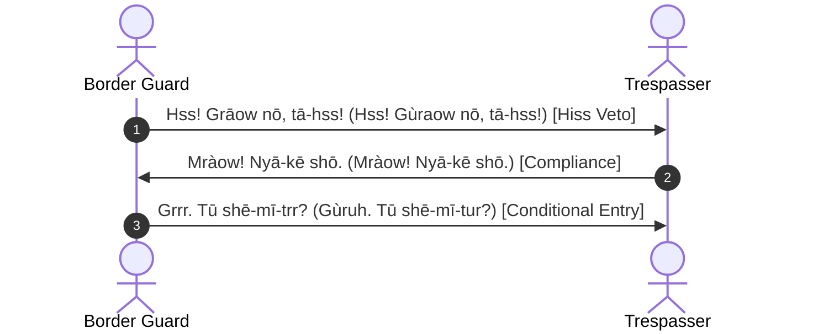

# Phrasebook 3: Warnings, Territorial Borders, & Emergency Protocols

**Essential Defensive and Emergency Dialogues in Dual Dialects**

---

## Dialogue 1: Guarding the Territorial Boundary

**Context**: A border guard notices an unknown figure approaching a clan line without emitting an entry greeting.

### 1. Border Guard (Initial Rejection)
- **Mraow-Trill**: *Hss! Grāow nō, tū tā-hss!*
- **Mraow-Ruh**: *Hss! Gùraow nō, tū tā-hss!*
- **Gloss**: `hiss! territory TOP, 2SG cross-PROH!`
- **Translation**: *"Hiss! Stay back! Do not cross this territorial boundary!"*

### 2. Trespasser (Immediate Sheathing of Claws)
- **Mraow-Trill**: *Mràow! Ī shō-pō; nyā-kē shō.*
- **Mraow-Ruh**: *Mràow! Ī shō-pō; nyā-kē shō.*
- **Gloss**: `halt! 1SG stop-PFV; claws retract`
- **Translation**: *"Halting immediately! My claws are fully retracted in peace."*

### 3. Guard (Inquiry under Law)
- **Mraow-Trill**: *Grrr. Tū mráow? Klān shā-trr?*
- **Mraow-Ruh**: *Gùruh. Tū məráow? Klān shā-tur?*
- **Gloss**: `law. 2SG who? clan identify-HORT?`
- **Translation**: *"By territorial law: Who are you? Which clan do you represent?"*

---

## Dialogue 2: Emergency Alert & Toxic Hazard

### 1. Scout
- **Mraow-Trill**: *Pft! Pft! Hsīna nō, lō-pft!*
- **Mraow-Ruh**: *Pft! Pft! Hsīna nō, lō-pft!*
- **Gloss**: `abort! abort! poison TOP, drop-ABORT!`
- **Translation**: *"Spit! Drop it immediately! That water is poisoned!"*

### 2. Clan Leader (Mobilization)
- **Mraow-Trill**: *Skrēe nō, klān grōm fō-trā-grr!*
- **Mraow-Ruh**: *Skēe nō, klān gùrōm fō-trā-gur!*
- **Gloss**: `crisis TOP, clan citadel assemble-URG-IMP!`
- **Translation**: *"Sound the alert! The clan must immediately assemble at the fortress!"*
