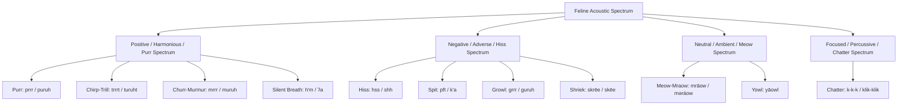

# Mraow Phonetics, Acoustic Classification & Dual-Dialect System

**A Detailed Guide to Pronouncing, Transcribing, and Modulating the Feline-Derived Human Language**

---

## 1. Acoustic Taxonomy of Feline Vocalizations

Natural feline acoustics comprise a distinct range of laryngeal vibrations, pulmonary expulsions, and mouth-shape modulations. For human articulation, these are mapped to precise International Phonetic Alphabet (IPA) equivalents.



### Table 1: Feline Sound Families & IPA Mapping

| Sound Family | Acoustic Character | Mraow-Trill (Classical) | Mraow-Ruh (Accessible) | IPA (Trill / Ruh) | Primary Semantic Domain |
| :--- | :--- | :--- | :--- | :--- | :--- |
| **Purr** | Continuous laryngeal vibration | `prrr` | `puruh` | `/prː/` vs `/ˈpʊ.rʌ/` | Deep safety, contentment, restorative healing, food |
| **Chirp / Trill** | Ascending rolled greeting | `trrrt` | `tùruht` | `/trːt/` vs `/ˈtʊ.rʌt/` | Friendly welcome, invitation to join, discovery |
| **Churr / Murmur** | Gentle low-frequency rumble | `mrrr` | `muruh` | `/mrː/` vs `/ˈmʊ.rʌ/` | Maternal care, familial affection, soothing touch |
| **Silent Breath** | Mouthed breath / soft aspiration | `h’m` / `’a` | `h’m` / `’a` | `/hm̥/` vs `/ʔa/` | Deep trust, spiritual devotion, inner secret |
| **Hiss** | Forced voiceless alveolar stream | `hss` | `hss` | `/hsː/` | Defensive boundary, refusal, toxicity, veto ("no") |
| **Spit** | Explosive voiceless burst | `pft` / `k’a` | `pft` / `k’a` | `/pft/` vs `/kʼa/` | Acute hazard, reflex rejection, venom, shock |
| **Growl** | Guttural / uvular friction | `grrr` | `gùruh` | `/grː/` vs `/ˈgʊ.rʌ/` | Territorial law, dominance, physical mass, warning |
| **Shriek / Scream**| High-tension vocalic burst | `skrēe` | `skēe` | `/skreː/` vs `/skeː/` | Severe injury, battle crisis, catastrophe |
| **Meow / Mraow** | Open-to-closed vocalic glide | `mrāow` | `məráow` | `/mraʊ⁵⁵/` vs `/məˈraʊ⁵⁵/` | Entities, baseline facts, standard objects, names |
| **Chatter** | Rapid staccato jaw-clicking | `k-k-k` | `klik-klik` | `/k.k.k/` vs `/klɪk.klɪk/` | Hunting focus, technical calculation, desire, observation |
| **Yowl** | Long sustained loud vocalization | `yāowl` | `yāowl` | `/jaʊl⁵⁵/` | Long-distance broadcasting, time, cosmology, era |

---

## 2. The Dual-Dialect System: Trill vs. Ruh

To ensure universal human accessibility while honoring the authentic acoustic soul of felid phonetics, Mraow is structured into two mutually intelligible dialects:

### 1. Dialect 1: Mraow-Trill (*Mraow-Rrr*) — Felid High Dialect
- Uses authentic alveolar trills `[r]`, lengthened sustained trills `[rː]`, and uvular growl trills `[ʀ]`.
- Retains compact consonant clusters: `pr-`, `tr-`, `gr-`, `mr-`, `-rrr`.
- Favored in formal poetry, traditional rituals, and fluent speakers with rolled-R capability.

### 2. Dialect 2: Mraow-Ruh (*Mraow-Rə*) — Human-Accessible Dialect
- Systematically resolves all trilled *r* phonemes into the vocalic syllable `"ruh"` (`[rʌ]`, `[rə]`, or `[ɹʌ]`) or inserts epenthetic schwa / rounded vowels:
  - Initial clusters: `pr-` $\rightarrow$ `pu-r-` or `puru-` (e.g. `prāow` $\rightarrow$ `purāow`).
  - Syllabic trills: `prrr` $\rightarrow$ `puruh`, `trrrt` $\rightarrow$ `tùruht`, `grrr` $\rightarrow$ `gùruh`, `mrrr` $\rightarrow$ `muruh`.
  - Cluster softening: `mrāow` $\rightarrow$ `məráow`.
- Retains identical syntax, vocabulary meaning, tone contours, and grammatical particles.

---

## 3. Tonal & Prosodic Modulation System

Mraow uses 5 distinct pitch contours marked with diacritics over vowels. These modulations convey stance, mood, information structure, and pragmatic intent:

```
Tone 1 (Level / Fact):     5 ─── 5   (ā, ē, ī, ō, ū)
Tone 2 (Rising / Question): 1 ─── 5   (á, é, í, ó, ú)
Tone 3 (Falling / Command): 5 ─── 1   (à, è, ì, ò, ù)
Tone 4 (Dipping / Playful): 4 ─ 1 ─ 4 (ǎ, ě, ǐ, ǒ, ǔ)
Tone 5 (Peaking / Alarm):   2 ─ 5 ─ 2 (â, ê, î, ô, û)
```

### 1. Level Tone (`¯` / Macron / `[55]`)
- **Pragmatic Meaning**: Statement of fact, static existence, continuous state, objective observation.
- **Example**: `Mrāow` (`/mraʊ⁵⁵/`) = *"It exists / That is a fact."*

### 2. Rising Tone (`´` / Acute / `[15]`)
- **Pragmatic Meaning**: Inquiry, polite petition, solicitation, seeking entry, curiosity.
- **Example**: `Mráow?` (`/mraʊ¹⁵/`) = *"Who is there? / May I enter? / What is this?"*

### 3. Falling Tone (``` ` ``` / Grave / `[51]`)
- **Pragmatic Meaning**: Finality, command, boundary enforcement, absolute assertion, closure.
- **Example**: `Mràow!` (`/mraʊ⁵¹/`) = *"Halt! / It is done! / Stand down!"*

### 4. Dipping Tone (`ˇ` / Caron / `[414]`)
- **Pragmatic Meaning**: Playful curiosity, stalking intention, hypothetical possibility ("if/maybe"), teasing.
- **Example**: `Prřt` (`/prːt⁴¹⁴/`) = *"Let us play / If we stalk together..."*

### 5. Peaking Tone (`ˆ` / Circumflex / `[252]`)
- **Pragmatic Meaning**: Surprise, sudden discovery, acute alarm, heightened revelation.
- **Example**: `Yâowl` (`/jaʊl²⁵²/`) = *"Look out! / Sudden shift in the field!"*

---

## 4. Phonation Registers & Dynamics

In addition to pitch contour, Mraow utilizes vocal register and volume dynamics:

1. **Modal Voice (Standard)**: Everyday communication between equals.
2. **Breathy / Whispered (`ʰ` / soft italics)**: Intimate domestic speech, communication between close bonded companions, secret messages, and submissive reassurance.
3. **Creaky / Vocal Fry (`̰` / underline)**: Spoken by elders, high perching authorities, formal territory boundary declarations.
4. **Dynamics**:
   - **Piano (Soft / Domestic)**: Standard indoor conversation.
   - **Forte (Loud / Territory Call)**: Long-range horizon signaling and emergency announcements.
