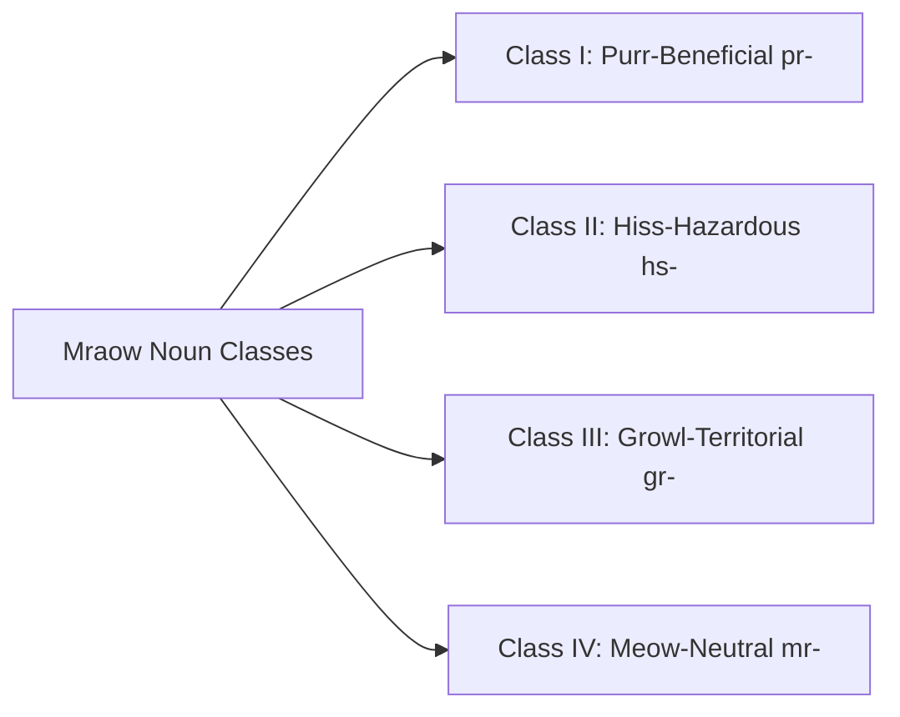

# Mraow Grammar & Valence System

**A Functional, Efficient Morphosyntactic Guide to Noun Classes, Verbal Moods, and Clause Architecture**

---

## 1. Grammatical Philosophy & Efficiency

Mraow is engineered for maximum communicative speed, emotional nuance, and semantic clarity. It achieves this through:
- **Topic-Comment Foundation**: The focal entity or setting is stated first, followed immediately by the action or condition.
- **Axiological Valence (Good vs. Bad Vocalizations)**: Everything in the universe is understood through its relation to safety/harmony vs. threat/conflict.
- **Compact Agglutination**: Mood, tense, and aspect are expressed through clean, monosyllabic clitics.

---

## 2. The 4 Valence Noun Classes (Genders)

Every noun in Mraow belongs to one of four valence classes, reflecting natural feline acoustic and environmental categorizations:



### Class I: Purr-Beneficial (*Benedictive / Animate Warmth*)
- **Marking**: Infix `-r-` or prefix `pr-` / `pur-`.
- **Domain**: Nourishing food, fresh water, sunny warm perches, trusted companions, healers, cushions, deep restorative rest.
- **Examples**:
  - `praow` (Trill) / `purāow` (Ruh) = *"Warm sunbeam / pleasant basking day"*
  - `prīna` / `purīna` = *"Wholesome nourishment / fresh meat"*
  - `mrīna` / `murīna` = *"Beloved bonded companion / family member"*

### Class II: Hiss-Hazardous (*Maledictive / Adverse Threat*)
- **Marking**: Infix `-s-` or prefix `hs-` / `sf-`.
- **Domain**: Venomous creatures, freezing rain, toxic plants, hostile strangers, sharp glass, traps, illness, deceit.
- **Examples**:
  - `hsaow` = *"Violent storm / freezing downpour"*
  - `hsīna` = *"Poison / tainted food"*
  - `hsāsh` = *"Hostile trespasser / enemy"*

### Class III: Growl-Territorial (*Heavy Mass / Legal Structure*)
- **Marking**: Infix `-g-` or prefix `gr-` / `gur-`.
- **Domain**: Mountains, stone walls, territorial boundary lines, laws, authority figures, heavy tools, immovable objects.
- **Examples**:
  - `grāow` / `gùraow` = *"Territory border / bedrock mountain"*
  - `grēx` / `gùrex` = *"Enforceable treaty / clan law"*

### Class IV: Meow-Neutral (*Descriptive / Common Entities*)
- **Marking**: Standard `mr-` / `m-` or unmarked vocalic stems.
- **Domain**: General instruments, paths, time measurements, neutral flora, open questions, mathematical quantities.
- **Examples**:
  - `mrāow` / `məráow` = *"Standard thing / baseline entity"*
  - `mīlo` = *"Walking path / corridor"*
  - `mōda` = *"Sun cycle / daylight hour"*

---

## 3. Valence Shifts (Derivational Infixing)

A single root concept can be systematically transformed across the valence matrix:

| Root Concept | Purr-Beneficial (Class I) | Hiss-Hazardous (Class II) | Growl-Territorial (Class III) | Meow-Neutral (Class IV) |
| :--- | :--- | :--- | :--- | :--- |
| **`aow`** (Atmosphere) | `praow` (*sunbeam, fine weather*) | `hsaow` (*storm, hail, blizzard*) | `graow` (*high mountain wind*) | `mraow` (*sky, ambient weather*) |
| **`īna`** (Sustenance) | `prīna` (*feast, fresh prey*) | `hsīna` (*spoilage, poison*) | `grīna` (*emergency rations / cache*) | `mīna` (*food, general sustenance*) |
| **`ōm`** (Shelter) | `prōm` (*safe warm den, hearth*) | `hsōm` (*trap, confinement, cage*) | `grōm` (*fortress, clan hall*) | `mōm` (*room, building, space*) |
| **`ēl`** (Water) | `prēl` (*pure spring water*) | `hsēl` (*stagnant / fouled puddle*) | `grēl` (*raging river / flood*) | `mēl` (*water, liquid*) |

---

## 4. Grammatical Verbal Moods

Verbs in Mraow express the speaker's emotional stance and pragmatic commitment via terminal mood clitics derived from feline vocalizations:

```
[Verb Stem] + [Aspect Clitic] + [Mood Suffix]
```

### Table of Verbal Mood Clitics

| Mood Suffix (Trill / Ruh) | Feline Origin | Grammatical Function | English Equivalent | Example |
| :--- | :--- | :--- | :--- | :--- |
| **`-prr`** / **`-pur`** | Purr | **Benedictive / Optative** | *"Happily do / love doing X"* | `mīna nā-prr` (*"I happily eat the food"*) |
| **`-trr`** / **`-tur`** | Chirp / Trill | **Hortative / Invitational** | *"Let us do X together / please do X"* | `mīlo tā-trr` (*"Let us walk together!"*) |
| **`-mrr`** / **`-mur`** | Churr / Murmur | **Reassurance / Benefactive** | *"Care for / do gently for X"* | `mrīna sā-mrr` (*"I comfort the companion"*) |
| **`-hss`** / **`-hss`** | Hiss | **Prohibitive / Avertive** | *"Do NOT do X / I detest X"* | `hsōm tā-hss` (*"Do not enter that trap!"*) |
| **`-grr`** / **`-gur`** | Growl | **Imperative / Coercive** | *"Must do X by command"* | `grāow kwā-grr` (*"You must guard the border!"*) |
| **`-kkk`** / **`-klik`** | Chatter | **Intentive / Desiderative** | *"Calculating / aiming to do X"* | `prīna chā-kkk` (*"I am stalking/aiming for food"*) |
| **`-pft`** / **`-pft`** | Spit | **Immediate Reflex Abort** | *"Instantly drop / abort action"* | `lō-pft` (*"Cease immediately!"*) |

---

## 5. Aspectual Markers (Sensory Metaphors)

Mraow encodes aspect through vivid physical metaphors:

1. **Prowling Aspect (Imperfective / Progressive)**: Clitic **`-chā`** (`-ka`) — Action is actively underway, stalked in real time.
2. **Pouncing Aspect (Perfective / Completed)**: Clitic **`-pō`** — Action has landed cleanly with claw contact; finished.
3. **Basking Aspect (Habitual / Stative)**: Clitic **`-lā`** — Action occurs regularly like resting in a daily sunbeam.
4. **Perching Aspect (Prospective / Planned)**: Clitic **`-vī`** — Action is observed from high elevation; about to happen.

---

## 6. Clause Architecture & Syntax

### Topic-Comment Base Structure
Mraow sentences begin with the **Topic** (the entity or situation under discussion, marked with the topic particle **`nō`** or by position), followed by the **Comment** (Subject-Verb-Object or Verb-Object):

$$\text{[Topic]} \quad (\text{nō}) \quad + \quad \text{[Subject]} \quad + \quad \text{[Verb-Aspect-Mood]} \quad + \quad \text{[Object]}$$

### Examples

1. **Positive Welcoming Greeting**:
   - **Mraow-Trill**: *Tū mrīna nō, ī shā-trr.*
   - **Mraow-Ruh**: *Tū murīna nō, ī shā-tur.*
   - **Gloss**: `2SG companion TOP, 1SG welcome-HORT`
   - **Translation**: *"As for you, dear companion, I warmly welcome you!"*

2. **Boundary Warning**:
   - **Mraow-Trill**: *Grāow nō, tū tā-hss!*
   - **Mraow-Ruh**: *Gùraow nō, tū tā-hss!*
   - **Gloss**: `territory.BORDER TOP, 2SG enter-PROH`
   - **Translation**: *"As for this territory border, do not enter!"*

3. **Contented Dining**:
   - **Mraow-Trill**: *Prīna nō, ī nā-pō-prr.*
   - **Mraow-Ruh**: *Purīna nō, ī nā-pō-pur.*
   - **Gloss**: `prey.BEN TOP, 1SG eat-PFV-BEN`
   - **Translation**: *"The fresh meal, I have eaten it with great contentment."*
