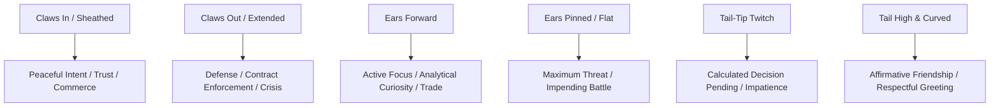

# Mraow Cultural Worldview & Sensory Philosophy

**The Philosophical, Metaphorical, and Physical Mindset of the Mraow Language**

---

## 1. Core Environmental & Sensory Philosophy

The Mraow language is grounded in the perceptual apparatus and survival psychology of predatory felids adapted for human thought. Human speakers of Mraow structure their reality through three foundational sensory axes:

1. **Elevation Axis (*Perch vs. Prowl vs. Den*)**:
   - Wisdom, oversight, strategy, and authority come from high vantage points (*the High Perch*).
   - Practical work, trade, and social negotiation occur on ground level (*the Prowl*).
   - Rest, healing, intimacy, and sacred secrets retreat into enclosed spaces (*the Warm Den*).

2. **Axiological Olfactory Axis (*Scent-Marked vs. Untamed*)**:
   - Safe territory is *scent-mapped* (`shē-mōk`): familiar, negotiated, lawful, purr-valenced.
   - Hazardous territory is *raw / unmarked* (`hsā-mōk`): unpredictable, high risk, hiss-valenced.

3. **Solar & Thermal Dynamics (*Sunbeam Cycling*)**:
   - Time and comfort are measured in moving patches of radiant heat.
   - Happiness is *basking* (`prā-lā`), moving harmoniously with the changing day without frantic rush.

---

## 2. Cultural Idioms & Metaphors

### Table of Core Cultural Idioms

| Mraow Idiom (Trill / Ruh) | Literal Translation | Cultural Meaning |
| :--- | :--- | :--- |
| **`Nyā-kē shō`** (`Nyā-kē shō`) | *"Claws retracted into sheath"* | Peace pact, peaceful meeting, honest commercial negotiation |
| **`Nyā-kē trā`** (`Nyā-kē trā`) | *"Claws extended onto bark"* | Legal claim, readiness for conflict, contractual enforcement |
| **`Prā-lā mōm`** (`Purā-lā mōm`) | *"Resting in the moving sunbeam"* | Thriving, content in life, prosperous leisure |
| **`Hsā-vōk nī`** (`Hsā-vōk nī`) | *"Stepping into cold water"* | Making a foolish mistake, encountering unexpected misery |
| **`Vī-shā kōr`** (`Vī-shā kōr`) | *"Viewing from the highest branch"* | Deep philosophical contemplation, strategic overview |
| **`Trr̂t-nō mī`** (`Tùruht-nō mī`) | *"A chirping step"* | A joyful breakthrough, an auspicious new beginning |

---

## 3. Social Protocol & Etiquette

In Mraow society, communication follows strict biological politeness rules:

1. **Approach & Greeting Protocol**:
   - Approaching directly without vocal greeting is perceived as predatory stalking.
   - The polite speaker emits a rising trill (`Trr̂t?` or `Tùruht?`), requesting recognition.
   - The host responds with an affirmative churr (`Mrrr` or `Muruh`), granting permission to share space.

2. **The Right of Refusal (The Hiss Covenant)**:
   - A single hiss (`Hss`) is absolute. It is not considered rude; it is a sacred boundary marker that all lawful speakers immediately respect without retaliation.
   - Ignoring a hiss triggers the legal right to unsheathe claws (`Nyā-kē trā`).

3. **Silence (*The Whispered Breath*)**:
   - Complete silence accompanied by a slow blink is the highest honor of friendship and absolute loyalty, representing total vulnerability in another's presence.
